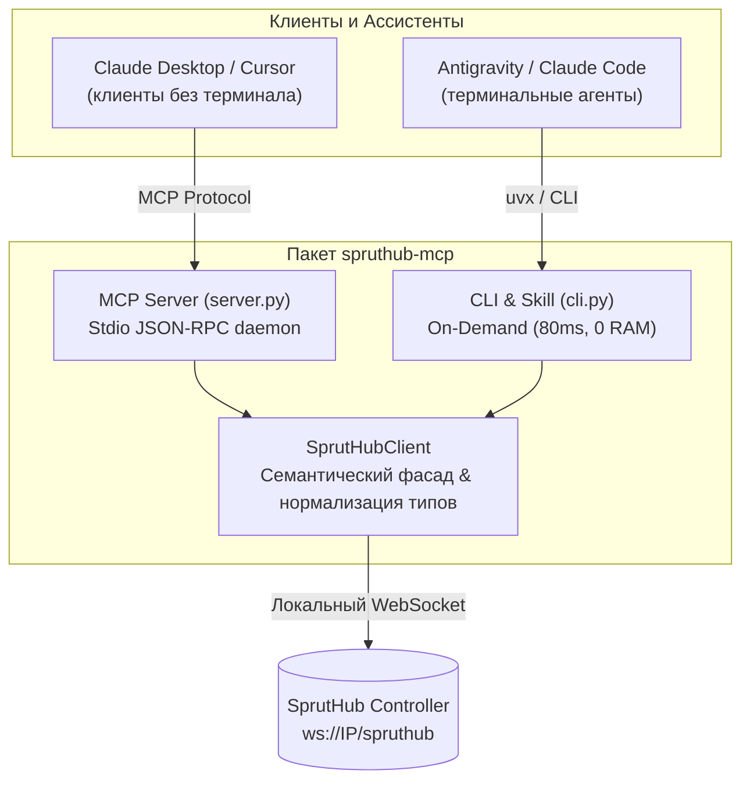

# SprutHub MCP & CLI Server

Высокоуровневая интеграция **SprutHub** для LLM-ассистентов (Antigravity, Claude Desktop, Cursor, Claude Code, Cline и др.).

Предоставляет два формата работы в одном пакете:
1. **MCP Server (`spruthub-mcp`)** — стандартный сервер протокола Model Context Protocol (для клиентов без доступа к терминалу, например Claude Desktop).
2. **On-Demand CLI (`spruthub-cli`) + Skill** — ультралегковесный запуск по требованию для терминальных агентов (Antigravity, Claude Code) с нулевым оверхедом по RAM и контекстному окну.

---

## Ключевые особенности

* ⚡ **Прямой локальный WebSocket:** прямое подключение к хабу в локальной сети (`ws://<IP>/spruthub`), нулевые задержки (< 5 мс), полная автономность без зависимости от облака.
* 🧠 **Семантический фасад вместо сырого RPC:** сервер берет на себя нормализацию данных, фильтрацию служебного мусора и разрешение сервисов, позволяя LLM работать за 1 шаг.
* 🛡️ **Автоматическая нормализация типов:** упаковка базовых типов (`bool`, `int`, `float`, `str`) в структуры SprutHub (`boolValue`, `intValue` и др.).
* 💡 **Умное переключение (`sprut_set_switch` / `cli switch`):** вам не нужно знать точный `service_id` или `characteristic_id` реле — система автоматически найдёт целевую службу `Switch`/`Lightbulb`/`Outlet`.
* 🔒 **Безопасная аутентификация:** работа по локальному паролю (токену) без необходимости хранить мастер-пароль от аккаунта.
* 🚀 **Нулевой оверхед (Hybrid Architecture):** поддержка работы как в виде фонового MCP-сервера, так и через легковесный CLI (~80 мс на выполнение запроса).

---

## Архитектурный подход: Семантический фасад vs Generic RPC-шлюз

При интеграции SprutHub с большими языковыми моделями возможны два подхода:

1. **Сырой generic-прокси (Raw RPC Gateway):** когда все методы контроллера транслируются в MCP «как есть», а LLM сначала ищет метод через `list_methods`, затем запрашивает его схему и пытается вручную собрать сложный JSON-RPC payload.  
   *Недостатки:* на каждое действие уходит 3–4 шага диалога, сотни килобайт сырых схем забивают контекст LLM, а сложная вложенность структур SprutHub приводит к частым галлюцинациям модели.
2. **Семантический фасад (подход данного проекта):** сервер агрегирует рутинную логику внутри себя. Он очищает списки устройств от сервисных метаданных (`AccessoryInformation`, `Identify`, `C_Online`), распаковывает типизированные структуры и предоставляет компактные, понятные функции.  
   *Результат:* модель решает задачу пользователя **за один шаг**, не тратит лишние токены и работает стабильно даже на лёгких и быстрых моделях.

## Архитектура: Двойной интерфейс (MCP + CLI)



---

## Инструменты и команды

| Категория | Команда CLI | MCP Tool | Описание |
|---|---|---|---|
| **Хаб и система** | `spruthub-cli info` | `sprut_get_hub_info` | Информация о контроллере (имя, модель, серийник, версия ПО, онлайн-статус). |
| | `spruthub-cli restart [--yes]` | `sprut_restart_hub` | Перезагрузка контроллера / службы SprutHub. |
| **Комнаты** | `spruthub-cli rooms` | `sprut_list_rooms` | Список комнат со сводкой датчиков в реальном времени. |
| | `spruthub-cli room create <name>` | `sprut_create_room` | Создание новой комнаты. |
| | `spruthub-cli room rename <id> <name>` | `sprut_update_room` | Переименование существующей комнаты. |
| | `spruthub-cli room delete <id> [--yes]`| `sprut_delete_room` | Удаление комнаты (с подтверждением). |
| **Устройства** | `spruthub-cli devices [--room ID] [-s query]` | `sprut_list_devices` | Список устройств и их текущих состояний (с фильтрацией). |
| | `spruthub-cli device <ID>` | `sprut_get_device` | Полная развернутая структура аксессуара (сервисы, характеристики, метаданные). |
| | `spruthub-cli switch <ID> <on/off>` | `sprut_set_switch` | Быстрое включение/выключение любого реле, выключателя, розетки или лампы. |
| | `spruthub-cli set <aId> <sId> <cId> <val>` | `sprut_set_characteristic` | Установка любого значения характеристики (яркость, температура, режим). |
| **История и датчики** | `spruthub-cli history <ID> [char] [--days N]` | `sprut_get_history` | Выгрузка временных рядов, расчет аналитики (min/max/avg/delta) и дневных сводок. |
| **Сценарии** | `spruthub-cli scenarios [-s query]` | `sprut_list_scenarios` | Список настроенных сценариев автоматизации и их статус. |
| | `spruthub-cli scenario run <name_or_idx>` | `sprut_run_scenario` | Запуск сценария автоматизации по имени или индексу. |
| **Диагностика** | `spruthub-cli logs [--count N] [--level LVL]` | `sprut_get_logs` | Просмотр системных логов контроллера и ошибок драйверов. |
| | `spruthub-cli extensions` | `sprut_list_extensions` | Статус всех протокольных расширений (Zigbee, BLE, HomeKit, MQTT и др.). |
| **Каталог шаблонов**| `spruthub-cli catalog list [-s query]` | `sprut_list_catalog` | Поиск и просмотр шаблонов поддерживаемых устройств в каталоге. |
| | `spruthub-cli catalog get <model_or_file>` | `sprut_get_catalog_template` | Получение схемы и маппинга сервисов конкретного шаблона оборудования. |

> 📖 **Полная документация низкоуровневого протокола:** [docs/SPRUTHUB_API.md](docs/SPRUTHUB_API.md) — карта всех 18 модулей и 62 RPC-методов ядра SprutHub.

---

## Где взять токен (локальный пароль)?

Всё настраивается за 10 секунд прямо из веб-интерфейса SprutHub:

1. В браузере откройте веб-интерфейс хаба (`http://<IP_ХАБА>`).
2. Перейдите в **Настройки** → **Пользователи** → откройте карточку вашего пользователя (Владелец).
3. Скопируйте значение из поля **«Локальный пароль»** (при необходимости можно сгенерировать новый кнопкой *«Сгенерировать новый пароль»*).

---

## Конфигурация

Для работы требуется всего два параметра: **IP-адрес (или хост) хаба** и **локальный пароль**.

Конфигурация автоматически определяется по цепочке:
1. Переменные окружения (`SPRUTHUB_HOST` и `SPRUTHUB_TOKEN`).
2. Системный файл конфигурации:
   * Linux / macOS: `~/.config/spruthub/config.json`
   * Windows: `%APPDATA%\spruthub\config.json`
3. Локальный файл `./config.json` в рабочей директории.

Пример `config.json`:
```json
{
  "host": "192.168.1.100",
  "token": "ВАШ_ЛОКАЛЬНЫЙ_ПАРОЛЬ"
}
```
*(Также поддерживается указание домена, например `"host": "spruthub.local"` или полного WebSocket URL, если у вас нестандартный порт или реверс-прокси).*

---

## Варианты использования

### Режим 1: Skill для Antigravity / Claude Code (Рекомендуется)

Идеальный режим: **0 байт RAM в простое, 0 лишних токенов в контексте**.

Ничего вручную копировать не нужно! Выберите любой удобный вариант:

#### Вариант А: Через промпт вашему AI-агенту (в 1 клик)
Просто отправьте вашему ассистенту в чат сообщение:
> «Установи скилл SprutHub из репозитория `pikerr/spruthub-mcp`. Мой хост: `192.168.1.100`, локальный пароль: `ВАШ_ПАРОЛЬ`»

Агент сам вызовет команду установки, сохранит конфиг и настроит скилл.

#### Вариант Б: Одной командой в терминале (Self-install)
```bash
uvx --from git+https://github.com/pikerr/spruthub-mcp spruthub-cli install --host 192.168.1.100 --token ВАШ_ПАРОЛЬ
```
Команда автоматически:
1. Сохранит данные в `~/.config/spruthub/config.json` с правами доступа `600`.
2. Установит скилл в `~/.gemini/config/skills/spruthub/` (и `~/.claude/skills/`).
3. Проверит соединение с вашим хабом.

После этого агент готов к управлению («выключи свет в спальне», «какая температура в кабинете»).

---

### Режим 2: MCP Server (для Claude Desktop / Cursor)

#### Автоматическая регистрация (Рекомендуется):
Одной командой зарегистрирует сервер в Claude Desktop и/или Cursor (с сохранением резервной копии старого конфига):
```bash
uvx --from git+https://github.com/pikerr/spruthub-mcp spruthub-cli install-mcp --host 192.168.1.100 --token ВАШ_ПАРОЛЬ
```
*(Либо передайте флаг `--mcp` при первой установке: `spruthub-cli install --mcp`, и утилита настроит и Skill, и Claude Desktop сразу)*.

#### Ручная настройка:
Если вы предпочитаете прописать конфиг вручную в `claude_desktop_config.json`:
```json
{
  "mcpServers": {
    "spruthub": {
      "command": "uvx",
      "args": ["--from", "git+https://github.com/pikerr/spruthub-mcp", "spruthub-mcp"],
      "env": {
        "SPRUTHUB_HOST": "192.168.1.100",
        "SPRUTHUB_TOKEN": "ВАШ_ЛОКАЛЬНЫЙ_ПАРОЛЬ"
      }
    }
  }
}
```

---

## Лицензия

[MIT](LICENSE)
